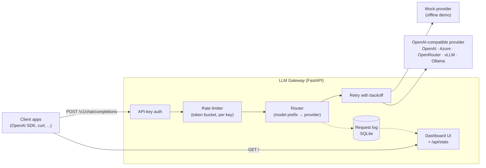

# LLM Gateway

A unified, observable API in front of LLM providers. One OpenAI-compatible
endpoint, many providers behind it — with API-key auth, per-key rate
limiting, automatic retries, request logging, cost estimation, and a live
observability dashboard.

The gateway runs **fully offline out of the box** on a built-in mock
provider, so you can clone it and see the whole system working in under a
minute — no API keys required.

## Screenshots


The observability dashboard after demo traffic: total requests, tokens, estimated cost and average latency, per-model/provider breakdowns, and the recent-requests log with status for every call.

## Architecture



The code is layered so each concern lives in one place:

| Layer | Module | Responsibility |
|---|---|---|
| API | `app/main.py` | Endpoints, OpenAI-shaped schemas, SSE streaming |
| Auth | `app/auth.py` | Bearer / `x-api-key` validation, key masking for logs |
| Rate limiting | `app/ratelimit.py` | In-memory token bucket per API key |
| Routing & retry | `app/routing.py` | Model-prefix routing, exponential backoff with jitter |
| Providers | `app/providers/` | One class per provider behind a common interface |
| Storage | `app/store.py` | SQLite request log + aggregate statistics |
| Pricing | `app/pricing.py` | Per-model price table and cost estimation |

## Features

- **OpenAI-compatible API** — existing OpenAI client code works by changing
  only the base URL and key.
- **Provider abstraction** — a built-in **mock provider** (offline demos,
  no keys) and an **OpenAI-compatible provider** for OpenAI, Azure,
  OpenRouter, Groq, Together, local vLLM/Ollama, etc.
- **Model routing** — route by model-name prefix (`gpt-*` → OpenAI,
  `mock-*` → mock) with a configurable default provider.
- **API-key authentication** for gateway clients; keys are never logged raw.
- **Per-key rate limiting** — token bucket, `429` + `Retry-After` on excess.
- **Retries with exponential backoff and jitter** on retryable provider
  errors (timeouts, 429, 5xx).
- **Streaming** — Server-Sent Events in the OpenAI chunk format, including
  simulated streaming from the mock provider.
- **Observability** — every request logged to SQLite (key, model, provider,
  tokens, latency, status, estimated cost) and visualized in a built-in
  dashboard: totals, cost, average latency, breakdowns by model/provider,
  and a recent-requests table with 5-second auto-refresh.

## Quick start

```bash
git clone <this-repo> && cd llm-gateway
python -m venv .venv && source .venv/bin/activate
pip install -r requirements.txt

cp .env.example .env        # defaults work offline with the mock provider
uvicorn app.main:app --port 8000
```

Then:

- Dashboard: <http://localhost:8000/>
- Health: <http://localhost:8000/health>
- API docs (Swagger): <http://localhost:8000/docs>

Seed the dashboard with demo traffic:

```bash
python seed_demo.py
```

### Docker

```bash
docker compose up --build
# dashboard on http://localhost:8000/
```

## API

### `POST /v1/chat/completions`

OpenAI-compatible request/response shape.

```bash
curl http://localhost:8000/v1/chat/completions \
  -H "Authorization: Bearer demo-key-123" \
  -H "Content-Type: application/json" \
  -d '{
    "model": "mock-1",
    "messages": [{"role": "user", "content": "Explain RAG in two sentences."}]
  }'
```

Response:

```json
{
  "id": "chatcmpl-…",
  "object": "chat.completion",
  "created": 1759276800,
  "model": "mock-1",
  "choices": [
    {"index": 0,
     "message": {"role": "assistant", "content": "[mock provider] You asked: …"},
     "finish_reason": "stop"}
  ],
  "usage": {"prompt_tokens": 12, "completion_tokens": 68, "total_tokens": 80}
}
```

Streaming (SSE) — add `"stream": true`:

```bash
curl -N http://localhost:8000/v1/chat/completions \
  -H "Authorization: Bearer demo-key-123" \
  -H "Content-Type: application/json" \
  -d '{"model": "mock-1", "stream": true,
       "messages": [{"role": "user", "content": "Hello"}]}'
```

### `GET /v1/models`

Lists the models the gateway can route, in the OpenAI list format.

### `GET /health`

```json
{"status": "ok",
 "providers": {"mock": "ready", "openai": "not_configured"},
 "auth_enabled": true,
 "rate_limit_rpm": 60}
```

### Dashboard feeds

- `GET /api/stats` — totals (requests, tokens, cost, avg latency),
  breakdowns by model and provider.
- `GET /api/requests?limit=25` — most recent logged requests.

### Using the OpenAI Python SDK

```python
from openai import OpenAI

client = OpenAI(base_url="http://localhost:8000/v1", api_key="demo-key-123")
reply = client.chat.completions.create(
    model="mock-1",
    messages=[{"role": "user", "content": "Hello, gateway!"}],
)
print(reply.choices[0].message.content)
```

## Configuration

All configuration is via environment variables — see `.env.example`.

| Variable | Default | Purpose |
|---|---|---|
| `GATEWAY_API_KEYS` | *(empty)* | Comma-separated client keys. Empty disables auth (dev only). |
| `RATE_LIMIT_RPM` | `60` | Requests per minute per API key (token bucket). |
| `MAX_RETRIES` | `3` | Retries on retryable provider errors. |
| `RETRY_BASE_DELAY` | `0.5` | Base seconds for exponential backoff. |
| `DEFAULT_PROVIDER` | `mock` | Provider used when no route matches. |
| `MODEL_ROUTES` | `mock:mock,gpt:openai,openai:openai` | `prefix:provider` pairs; longest prefix wins. |
| `OPENAI_API_KEY` | *(empty)* | Key for the OpenAI-compatible provider. |
| `OPENAI_BASE_URL` | `https://api.openai.com/v1` | Any OpenAI-compatible endpoint. |
| `LLM_MODEL` | `gpt-4o-mini` | Default model id of the OpenAI-compatible provider. |
| `PROVIDER_TIMEOUT` | `60` | Provider request timeout (seconds). |
| `DATABASE_PATH` | `data/gateway.db` | SQLite request-log location. |

To use a real model, set `OPENAI_API_KEY`, keep `OPENAI_BASE_URL` (or point
it at another compatible endpoint), and request a routed model such as
`gpt-4o-mini`.

## Scaling notes

The defaults favor a zero-setup demo; the seams for production are explicit:

- **Rate limiting** — the in-memory token bucket is per-process. Swap
  `TokenBucketLimiter` for a Redis-backed bucket (one Lua script, keyed by
  API key) to share limits across instances; the `allow()` interface stays
  the same.
- **Storage** — `app/store.py` is a thin layer over plain SQL. Point it at
  Postgres (connection string + driver) to keep the request log when running
  multiple replicas, and to query it with real analytics tooling.
- **Horizontal workers** — the gateway is stateless apart from the two items
  above, so it scales with `uvicorn --workers N` or multiple containers
  behind a load balancer once Redis + Postgres are in place.
- **Provider pool** — add providers as new classes in `app/providers/` and
  route to them via `MODEL_ROUTES`; add health-based failover by wrapping
  `with_retry` with a provider list.
- **Cost accuracy** — prices in `app/pricing.py` are estimates for reporting.
  For billing-grade numbers, reconcile against provider invoices or the
  provider's usage endpoints.

## Project layout

```
llm-gateway/
├── app/
│   ├── main.py            # FastAPI app: endpoints, streaming, dashboard routes
│   ├── config.py          # Environment-based settings
│   ├── auth.py            # API-key authentication
│   ├── ratelimit.py       # Token-bucket rate limiter
│   ├── routing.py         # Model routing + retry policy
│   ├── pricing.py         # Price table + cost estimation
│   ├── store.py           # SQLite request log + statistics
│   ├── providers/
│   │   ├── base.py        # Provider interface
│   │   ├── mock.py        # Offline mock provider
│   │   └── openai_provider.py
│   └── static/            # Dashboard (HTML/CSS/JS, no CDN dependencies)
├── seed_demo.py           # Fires ~20 sample requests at a running gateway
├── Dockerfile
├── docker-compose.yml
├── requirements.txt
└── .env.example
```

## License

MIT — see [LICENSE](LICENSE).

---
**More projects by Nisar Ahmad** — [GitHub profile](https://github.com/nisarahmad78) · [Portfolio site](https://nisarahmad78.github.io)
- [VOCALIQ — AI Voice Customer Experience Platform](https://github.com/nisarahmad78/VOCALIQ)
- [RAG Document Q&A](https://github.com/nisarahmad78/rag-document-qa)
- [LangGraph AI Agent](https://github.com/nisarahmad78/langgraph-ai-agent)
- [MCP Server Suite](https://github.com/nisarahmad78/mcp-server-suite)
- [AI Support Desk](https://github.com/nisarahmad78/ai-support-desk)
- [LLM Gateway](https://github.com/nisarahmad78/llm-gateway)
